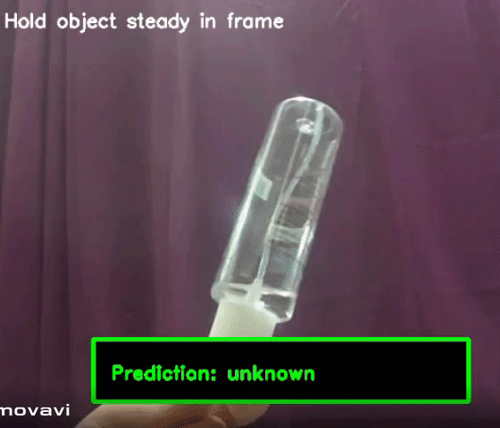

# AI-Vision-Classifier-System ♻️

**Automated Material Stream Identification (MSI) System**

The **AI-Vision-Classifier-System** is an end-to-end machine learning solution designed to automate waste sorting. It leverages **Deep Learning (ResNet50)** for sophisticated feature extraction and **Classical ML (SVM)** for high-precision classification. The system is designed for real-world reliability, featuring a confidence-based "Unknown" category to minimize misclassification.

---

## 🛠 Project Architecture

This project implements the complete machine learning lifecycle, from raw data cleaning to real-time deployment.

### 1. Data Preprocessing & Advanced Augmentation

To ensure the model generalizes well to real-world lighting and orientation, we developed a class-specific augmentation strategy:

* **Cleaning:** Identification and removal of corrupted image files to maintain dataset integrity.
* **Intelligent Splitting:** A standard 80/20 train/test split, with a custom override for the **Trash** category (35 original images preserved for testing) to handle high intra-class variability.
* **Phased Augmentation:** Utilizing the `albumentations` library, each class is augmented to reach a **500-image threshold** through three phases:
* **Phase 1:** Geometric transformations (rotation, flip) and lighting variations.
* **Phase 2:** Simulation of sensor artifacts via `GaussNoise` and `MotionBlur`.
* **Phase 3:** Subtle regularization through mild cropping and contrast adjustments.


* **Synthetic "Unknown" Generation:** A dedicated script, `unknown_creation.py`, generates Out-of-Distribution (OOD) samples by applying extreme Gaussian blur and intensity scaling to existing images, teaching the model to recognize "trash" or non-recyclable noise.

### 2. Feature Extraction & Dimensionality Reduction

Instead of raw pixel analysis, the system maps images into a high-dimensional mathematical space:

* **Backbone:** A pretrained **ResNet50** model is used as a feature extractor by removing the final classification layer.
* **Vectorization:** Every image is converted into a dense **2048-dimensional numerical vector**.
* **PCA Optimization:** To improve training speed and reduce noise, we apply **Principal Component Analysis (PCA)**, retaining **98%** of the data variance while significantly compressing the feature space.

### 3. Classification Models

We evaluated two primary architectures to find the optimal balance of speed and precision:

| Feature | **SVM (Final Model)** | **KNN (Baseline)** |
| --- | --- | --- |
| **Kernel/Metric** | RBF (Radial Basis Function) | Cosine Similarity |
| **Logic** | One-vs-Rest (OvR) | Distance-based weights |
| **Scaling** | `StandardScaler` (Z-score) | `StandardScaler` (Z-score) |
| **Probability** | Enabled via Platt scaling | Distance-based confidence |

---

## 👁️ Real-Time Deployment

The `realtime_app.py` script serves as the production interface, utilizing a laptop webcam for live material stream identification.

* **Inference Loop:** Captures and processes a frame once every second to maintain high performance without exhausting hardware.
* **Safety Threshold:** The system employs a rigorous confidence check. If the predicted probability , the item is classified as **"Unknown"** to prevent false positives.
* **Visual Feedback:** An on-screen UI provides a centered bounding box with the label and confidence percentage.

---

## 📺 Live System Demo
Below is a demonstration of the **AI-Vision-Classifier-System** identifying various materials in real-time. Note how the system correctly labels items and triggers the "Unknown" class when confidence drops below 60%.

<div align="center">
  
</div>

### 📸 System Highlights

| Feature | Implementation |
| --- | --- |
| **Real-time Identification** | Processes frames every 1s using OpenCV to provide a stable, flicker-free prediction. |
| **Safety Threshold** | If a non-recyclable or blurry object is shown (), the model defaults to **"Unknown"**. |
| **Visual Feedback** | Features a centered prediction box with real-time confidence percentages. |

---
## 🚀 Getting Started

### Installation

```bash
pip install -r requirements.txt

```

### Execution Order

To ensure the models are properly trained and the live app has access to the correct weights, run the scripts in this order:

1. `python data_preprocessing.py` (Prepare and augment data)
2. `python feature_extraction2.py` (Extract deep features)
3. `python pca.py` (Apply dimensionality reduction)
4. `python train_svm.py` (Train the primary classifier)
5. `python realtime_app.py` (Launch the live webcam interface)

---

## 👥 Development Team

* **Mahmoud Khaled** 
* **Mariam Amro** 
* **Noran Mahmoud** 
* **Philopateer Karam** 
* **Salma Yasser** 
